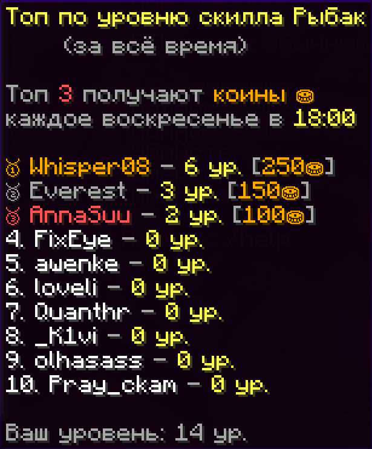

# Tops System 🏆

Плагин для создания и управления таблицами лидеров с автоматической выдачей наград.

---

## 📋 Возможности

- 📊 Гибкая система топов с поддержкой различных провайдеров данных
- 🎁 Автоматическая выдача наград топ-игрокам по расписанию
- 💰 Интеграция с CoinsEngine для выдачи валюты
- 🎯 Настраиваемые позиции и размеры наград
- ⚡ Кэширование данных для оптимизации
- 📊 Отправка статистики на внешние серверы
- 🎮 Красивый GUI интерфейс для просмотра топов

 

---

## 🎮 Команды

```plaintext
/tops - открыть GUI с таблицами лидеров
/tops reload - перезагрузить конфигурацию и кэш (требует права topssystem.reload)
/tops rewards - принудительно выдать награды (требует права topssystem.rewards)
```

---

## 🔐 Права доступа

```plaintext
topssystem.exclude - исключает игрока из всех топов
topssystem.reload - позволяет использовать /tops reload
topssystem.rewards - позволяет использовать /tops rewards
```

---

## ⚙️ Конфигурация

### Основные настройки

```yaml
# Настройки GUI
gui:
  title: "🏆 Топы игроков"  # Заголовок GUI
  size: 54                 # Размер инвентаря (должен быть кратен 9)
  filler_item: "GRAY_STAINED_GLASS_PANE"  # Заполнитель пустых слотов

# Настройки кэша
cache:
  duration_minutes: 15     # Длительность кэша в минутах

# Настройки отправки статистики
stats:
  enabled: true           # Включить отправку статистики
  api_url: "http://192.168.0.120:8000/tops/update/"  # URL API сервера
  api_key: "your-api-key" # API ключ для авторизации

# Настройки наград
rewards:
  currency: "coins"       # Валюта для наград (должна существовать в CoinsEngine)
  distribution_time: "SUNDAY 18:00"  # Время выдачи наград (ДЕНЬ_НЕДЕЛИ ЧЧ:мм)
  position_rewards:       # Награды за позиции
    1: 250                # 1 место - 250 coins
    2: 150                # 2 место - 150 coins
    3: 100                # 3 место - 100 coins
    # 4: 50               # Можно добавить больше позиций
    # 5: 25
```

### Категории топов

```yaml
categories:
  # CoinsEngine - топы по валютам
  coins_engine_coins:
    display_name: "§eТоп по балансу коинов §6⛂"
    slot: 9
    item: "PLAYER_HEAD"
    texture: "eyJ0ZXh0dXJlcyI6eyJTS0lOIjp7InVybCI6Imh0dHA6Ly90ZXh0dXJlcy5taW5lY3JhZnQubmV0L3RleHR1cmUvZWJkYTVmMzE5MzdiMmZmNzU1MjcxZDk3ZjAxYmU4NGQ1MmE0MDdiMzZjYTc3NDUxODU2MTYyYWM2Y2ZiYjM0ZiJ9fX0="
    lore_template:
      - "§7      (за всё время)"
      - ""
      - "%top_players%"
      - ""
      - "§7Ваши коины: %player_level%"

  # AuraSkills - топы по навыкам
  aura_skills_farming:
    display_name: "§eТоп по уровню скилла Фермер"
    slot: 14
    item: "IRON_HOE"
    lore_template:
      - "§7      (за всё время)"
      - ""
      - "%top_players%"
      - ""
      - "§7Ваш уровень: %player_level%"

  # TimeReward - топы по времени игры
  playtime_total:
    display_name: "§eТоп по времени (общий)"
    slot: 11
    item: "PLAYER_HEAD"
    texture: "eyJ0ZXh0dXJlcyI6eyJTS0lOIjp7InVybCI6Imh0dHA6Ly90ZXh0dXJlcy5taW5lY3JhZnQubmV0L3RleHR1cmUvODVmYTBhM2EyZDYyZDdkMTE3MWQ0OGIzYWU4ZmNiNTUxZjZmYWNjYzcwY2VlNDBmNDRjNzY3YzNkYTdiNzg1ZiJ9fX0="
    lore_template:
      - "§7      (за всё время)"
      - "§7(время §cAFK §7- не учитывается)"
      - ""
      - "%top_players%"
      - ""
      - "§7Ваше время: %player_level%"

  playtime_weekly:
    display_name: "§eТоп по времени (неделя)"
    slot: 18
    item: "PLAYER_HEAD"
    texture: "eyJ0ZXh0dXJlcyI6eyJTS0lOIjp7InVybCI6Imh0dHA6Ly90ZXh0dXJlcy5taW5lY3JhZnQubmV0L3RleHR1cmUvZmNiOGYwNjg4NWQxZGFhZmQyNmNkOTViMzQ4MmNiNTI1ZDg4MWE2N2UwZDI0NzE2MWI5MDhkOTNkNTZkMTE0ZiJ9fX0="
    lore_template:
      - "§7      (за неделю)"
      - "§7(время §cAFK §7- не учитывается)"
      - ""
      - "%top_players%"
      - ""
      - "§7Ваше время: %player_level%"

  # TrackPlayer - топы по убийствам мобов
  mob_kills:
    display_name: "§eТоп по убийствам монстров"
    slot: 19
    item: "PLAYER_HEAD"
    texture: "eyJ0ZXh0dXJlcyI6eyJTS0lOIjp7InVybCI6Imh0dHA6Ly90ZXh0dXJlcy5taW5lY3JhZnQubmV0L3RleHR1cmUvYjJhMWZkMmQ3Y2ZiZGQyYThkOWIzZjgxZjczMTI3MDViODlhNDRkMzhiODQxMDExYTdlNzllYTZiOWJjODU4NCJ9fX0="
    lore_template:
      - "§7      (за неделю)"
      - ""
      - "%top_players%"
      - ""
      - "§7Ваши убийства мобов: %player_level%"
```

---

## 🔌 Интеграции

### CoinsEngine
Для отслеживания топов по валютам используйте префикс `coins_engine_`:
```yaml
coins_engine_coins:    # Баланс основной валюты
coins_engine_gems:     # Баланс драгоценных камней
coins_engine_tokens:   # Баланс токенов
```

### AuraSkills
Для отслеживания топов по навыкам используйте префикс `aura_skills_`:
```yaml
aura_skills_farming:    # Навык фермерства
aura_skills_mining:     # Навык майнинга
aura_skills_fighting:   # Навык боя
aura_skills_foraging:   # Навык собирательства
aura_skills_fishing:    # Навык рыбалки
```

### TimeReward
Доступные категории для времени игры:
```yaml
playtime_total:    # Общее время на сервере
playtime_weekly:   # Время за текущую неделю
```

### TrackPlayer
Доступные категории для статистики:
```yaml
mob_kills:         # Убийства мобов за неделю
```

---

## 🚀 Использование

### Создание новой категории
1. Добавьте новую запись в раздел `categories` конфига
2. Используйте правильный префикс для типа данных
3. Настройте слот, предмет и описание

### Исключение игроков из топов
Чтобы исключить игрока из всех топов, выдайте ему право:
```plaintext
/lp user <player> permission set topssystem.exclude true
```

---

## 📊 Формат данных для API

При отправке статистики на сервер используются следующий формат данных:

```json
{
  "serverName": "Minecraft Server",
  "timestamp": 1700000000000,
  "categories": [
    {
      "id": "playtime_weekly",
      "displayName": "Время за неделю",
      "description": "",
      "icon": "",
      "topPlayers": [
        {
          "uuid": "a1b2c3d4-e5f6-7890-abcd-ef1234567890",
          "name": "Player1",
          "displayValue": "50 часов",
          "rawValue": 50.0
        }
      ]
    }
  ]
}
```

---

## 🔧 Техническая информация

- Кэш обновляется каждые 15 минут (настраивается)
- Награды выдаются автоматически по расписанию
- GUI автоматически обновляет данные при открытии
- Поддерживается Paper 1.21.8
- Требует установки CoinsEngine для работы наград

---

## ❓ Часто задаваемые вопросы

**Q: Как добавить новую валюту для топов?**
A: Добавьте категорию с префиксом `coins_engine_` и названием валюты

**Q: Как изменить время выдачи наград?**
A: Отредактируйте `distribution_time` в формате "DAY_OF_WEEK HH:mm"

**Q: Почему игрок не появляется в топе?**
A: Проверьте что у игрока нет права topssystem.exclude

**Q: Как принудительно обновить кэш?**
A: Используйте команду `/tops reload` с правами topssystem.reload

---

## Требования

- Minecraft Paper 1.21.8
- Java 21

### Обязательные зависимости
- **[CoinsEngine](https://github.com/nulli0n/CoinsEngine-spigot)** - для выдачи наград (и опционально для отображения топов по валютам)
- **[LuckPerms](https://github.com/LuckPerms/LuckPerms)** - для проверки прав `topssystem.exclude` у офлайн-игроков

### Опциональные зависимости
- **[AuraSkills](https://github.com/Archy-X/AuraSkills)** - для отображения топов по навыкам
- **[TimeReward](https://github.com/flyawaymaking/TimeReward)** - для отображения топов по времени игры
- **[TrackPlayer](https://github.com/flyawaymaking/TrackPlayer)** - для отображения топов по убийствам мобов

**Примечание:** Плагин будет работать без опциональных зависимостей, но соответствующие категории топов не будут отображаться.

---

## Установка

1. Скачайте **последний релиз** из раздела [Releases](../../releases)
2. Поместите его в папку /plugins
3. Перезапустите сервер
4. Настройте config.yml при необходимости
5. Используйте /tops reload, чтобы применить изменения без перезапуска

---

## 📄 Лицензия

Плагин распространяется под лицензией MIT.
